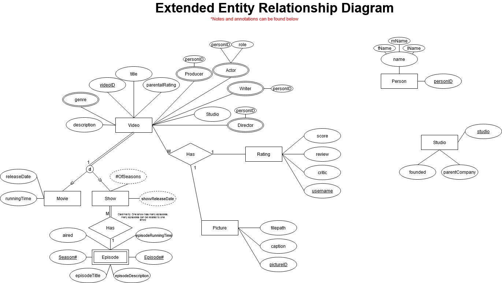
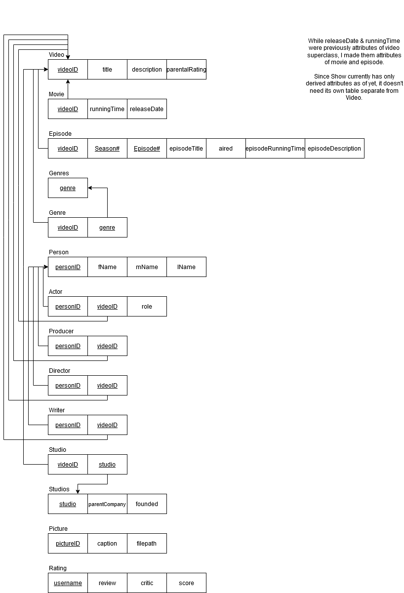

# IMDb-TSV-Converter

Simple C program to convert IMDb's TSV datasets to CSVs compatible &amp; importable with my own database design.

## Documentation

### Personal Database Structure

My personal database for which this application is built for has the following structure:

### IMDb TSV Datasets & Structures

The information that will be actually useful to us is below.

#### name.basics

Column 1: nconst (string) <-- personID

Column 2: primaryName (string) <-- Full name of person

Column 3: birthYear (unsigned int)

Column 4: deathYear (unsigned int)

Column 6: knownForTitles (string in CSV format) <-- Useful for tying people to acting in videos

#### title.basics

Column 1: tconst        (string) <-- The unique ID assigned to every movie, show, and episode

Column 2: titleType     (string) <-- may be useful: short, video, tvMovie, movie, tvEpisode, 

videoGame, tvSeries, etc

Column 3: primaryTitle  (string)

Column 6: startYear     (unsigned int)

Column 8: runtimeMinutes(unsigned int)

Column 9: genres        (string in CSV format)

#### title.episode

Column 1: tconst (string) <-- the episode ID

Column 2: parentTconst (string) <-- the show ID

Column 3: seasonNumber (unsigned int) <-- the season of the show to which the episode belongs

Column 4: episodeNumber (unsigned int) <-- the episode number of the show. I believe this is in total, accounting for past seasons as well.

If the last two values are \N then I'm not really sure what that means, it's undefined for now. Just don't add the episode to our database CSV, remove from videoImportCSV.

#### title.crew

#### title.ratings

### IMDb Data Converter Algorithm

Given the above information, I have derived the following:

We will start by importing all values from all tables. If a tconst has a parentTconst, it's an episode rather than its own entity so remove that tconst from the videoImportCSV.
